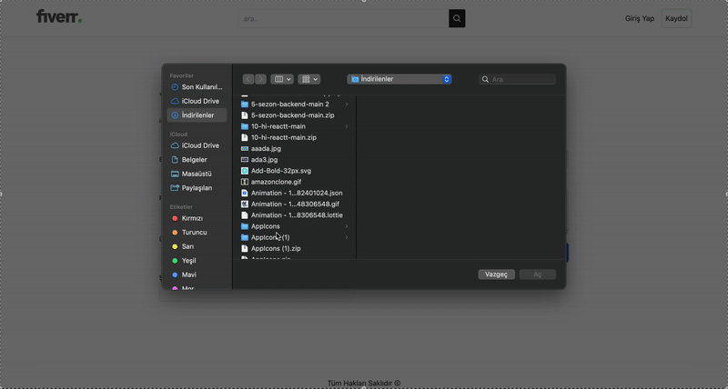
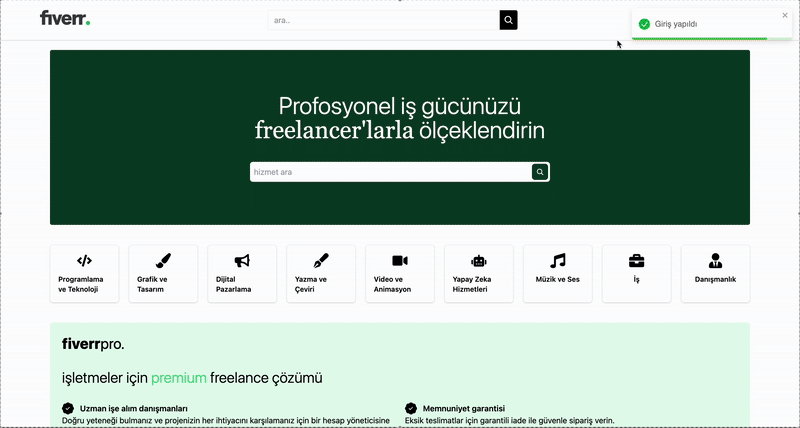
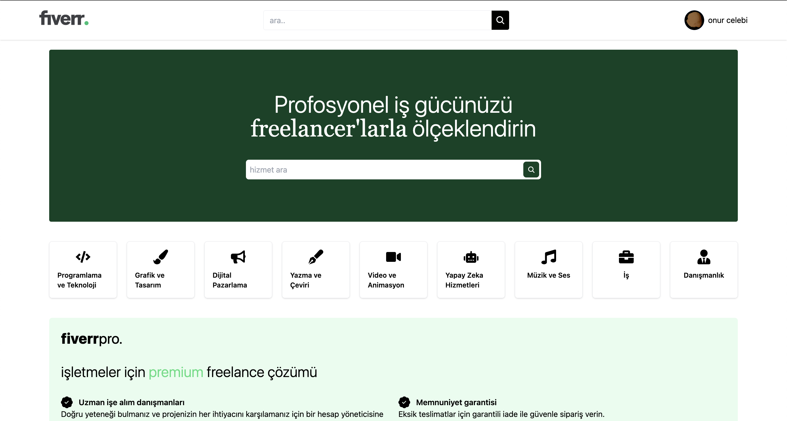
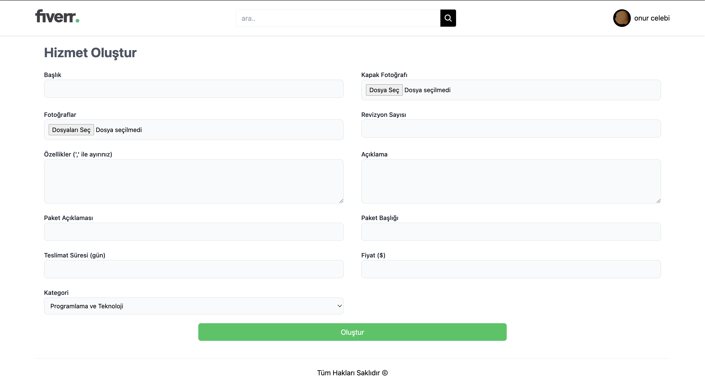
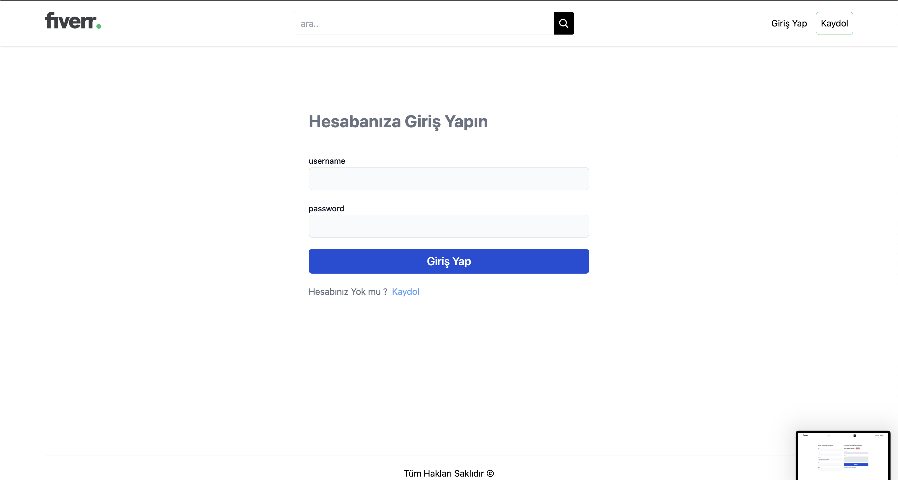
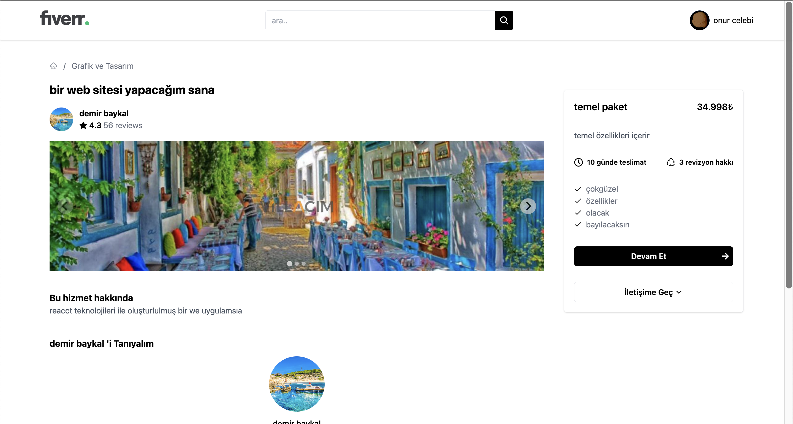
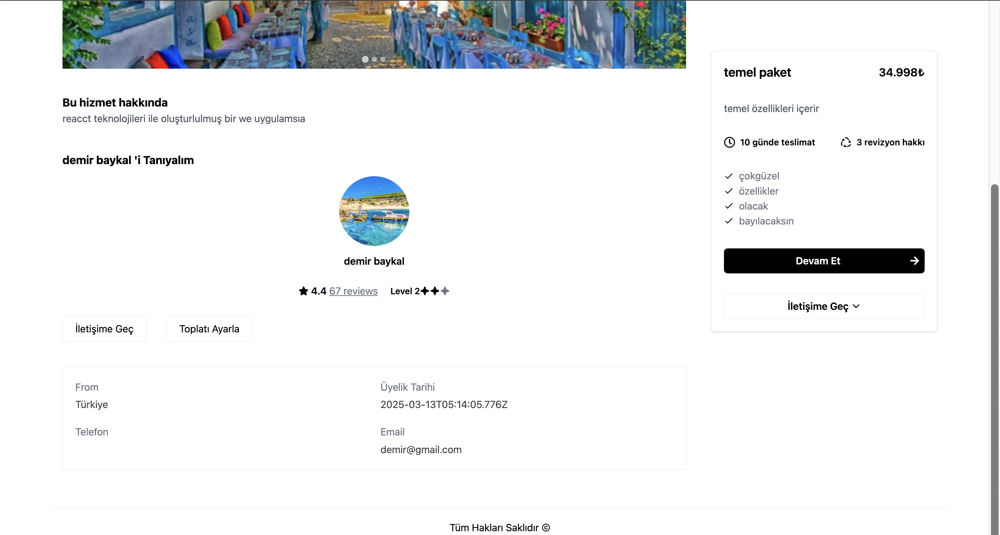

# Fiverr Clone 🎨💻

This project is a **full-stack freelancing platform** that replicates the core functionalities of Fiverr.  
Users can register, post services (Gigs).

## 📸 Screenshots

### 📹 Video GIF





### 🏠 Home Screen



### 🩳 Register Screen


### 👔 Create Screen



### Login Screen



### GigDetail Screen




## 🚀 Technologies Used

### **Frontend (Client)**

- ⚛️ **React.js + TypeScript** - Strongly typed modern UI development
- ⚡ **Vite** - Fast development environment
- 🎨 **Tailwind CSS** - Utility-first styling
- 🌐 **React Router v7** - Page navigation
- 🔥 **TanStack React Query** - Efficient API data fetching & caching
- 🍪 **React Cookie** - Cookie & authentication management
- 📢 **React Toastify** - Notification system for better UX
- 🎨 **React Icons** - Scalable vector icons
- 📆 **Moment.js** - Date and time manipulation
- 📊 **Splide.js** - Lightweight and flexible slider/carousel
- 🔗 **Axios** - HTTP requests handling

### **Backend (Server)**

- 🏗 **Node.js + Express.js + TypeScript** - API development with strict typing
- 🗄 **MongoDB & Mongoose** - NoSQL database
- 🔐 **JWT (JSON Web Token)** - Authentication & authorization
- 🔑 **Bcrypt** - Secure password hashing
- 🍪 **Cookie-Parser** - Managing user sessions & cookies
- 🌍 **CORS** - Cross-Origin Resource Sharing
- 📂 **Multer & Cloudinary** - File upload & storage
- 🚀 **Zod** - Schema validation
- ⚡ **Ts-Node** - Run TypeScript directly in Node.js
- 🔁 **Nodemon** - Auto-restart server during development
- 📜 **TypeScript** - Type safety for backend development
- 📚 **@types (for TypeScript)** - Type definitions for various libraries:
  - `@types/bcrypt`
  - `@types/cookie-parser`
  - `@types/cors`
  - `@types/express`
  - `@types/jsonwebtoken`
  - `@types/mongoose`
  - `@types/multer`
  - `@types/node`

---

## 📌 **Features**

✅ **User Registration & Authentication** (JWT-based)  
✅ **Create & Manage User and Seller Accounts**  
✅ **Only Sellers Can Create & Delete Their Own Gigs**  
✅ **Image Upload & Storage** (Cloudinary)

---

## **👥 User Roles**

**1️⃣ Standard User (Buyer)**

- 🎯 Can browse and purchase gigs

**2️⃣ Seller (Freelancer)**

- 🎨 **Can create & manage their own gigs**
- ❌ **Can only delete their own gigs**
- 📄 **Can view their seller profile & services**

---

## 🔧 **Installation & Setup**

**1️⃣ Clone the Repository**

```sh
git clone https://github.com/ozerbaykal/fiver_Full_Stack.git
cd fiverr-clone

Install & Start Backend

cd api
npm install
npm run dev

 Install & Start Frontend

 cd client
npm install
npm run dev

```

## 📌 TypeScript-Specific Enhancements
✔ Type-Safe API Responses - No more any type, strict typings for all responses.
✔ Zod for Validation - API requests are validated using Zod to prevent malformed data.
✔ Typed Express Middleware - Strongly typed middleware for authentication and role-based access.
✔ Custom Hooks with TypeScript - Fully typed React Query hooks for API communication.

## 📌 Contributing
Want to contribute? Follow these steps:

Fork the repository 🍴
Create a new branch 🌿
Make your changes & commit 📌
Submit a pull request 🚀

## 📞 Contact
👨‍💻 Developer: Özer BAYKAL
📧 Email: baykalozer87@gmail.com
🔗 LinkedIn:linkedin.com/in/özer-baykal
📂 GitHub: (https://github.com/ozerbaykal)
